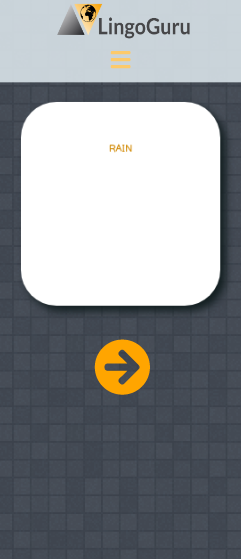

# LingoGuru

As a final project for our Software Engineering course, my team and I decided to make a language learning app.
In the app you can paste a text and while you are reading you can select a word which you like to know the translation of. The selected word will be translated and you can save it in your flashcards to revise it later.
These functionalities make language learning easy and efficient!

## Setup

If you would like to see our code, clone my repository. To run in localhost:
- npm i
- npm start

or click the link to see our deployed app

https://lingoguru.netlify.app/

    
Desktop view

    
    
Mobile view

    

## To start

You will be required to make your account to use our app. To set your avatar go to Profile. There you can adjust any details and change a language.

Profile

## Learn

In learn you can use the translator to translate your text and save words to your flashcards.

Learn

## Flashcards

To view your flashcards you can click button 'View my Flashcards' on Home page or in Learn under Translator. There you will see your saved flashcard. They will be randomly rendered. Click on a flashcard to see its translation. By clicking the orange arrow you get the next flashcard.

    
Desktop view

    
    
Mobile view

    

## Technologies

The project was made with React using hooks. The following frameworks/technologies were used:

- Axios
- PropTypes
- Google Translate API
- AvatarEditor
- ReactCardFlip
- FontAwesomeIcon

## Testing utilities 

- Jest
- React Testing Library

## Contributing

Pull requests are welcome. For major changes, please open an issue first to discuss what you would like to change.

## Kudos

Created by Niall Greene, Wil Powell and Viktoriia Petrova as part of <a href="https://www.manchestercodes.com" target="_blank">Manchester Codes</a> learning process.
